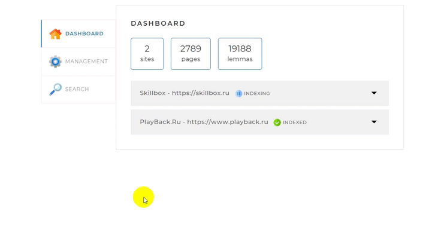
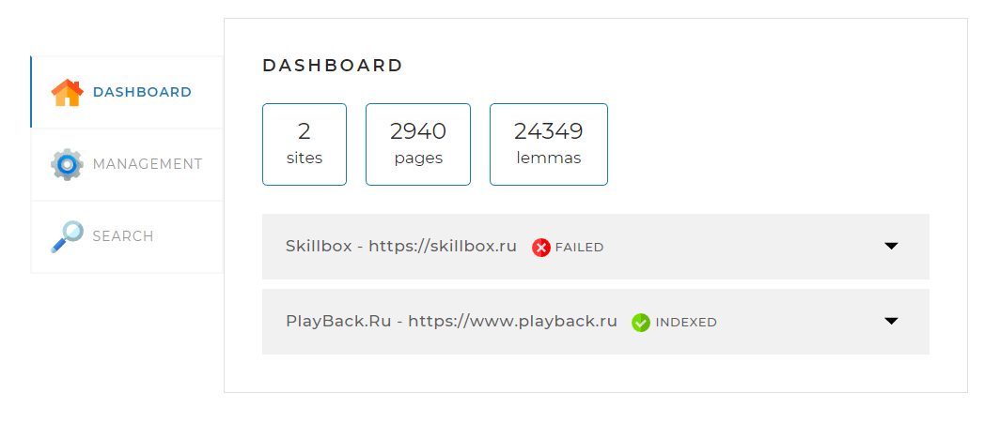
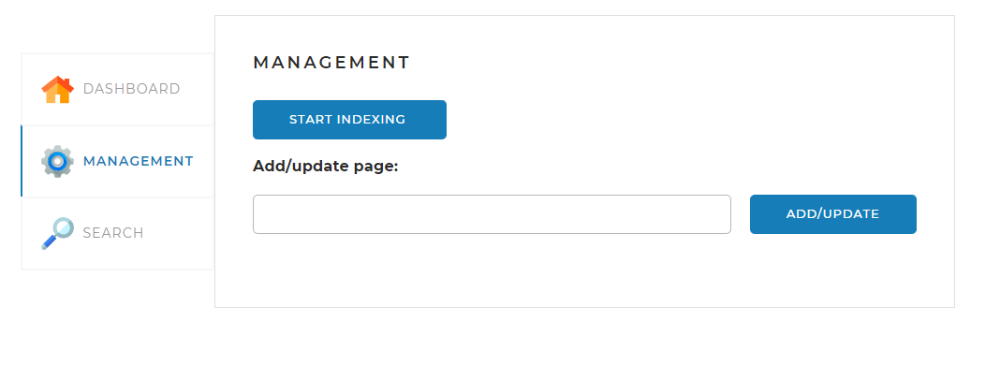
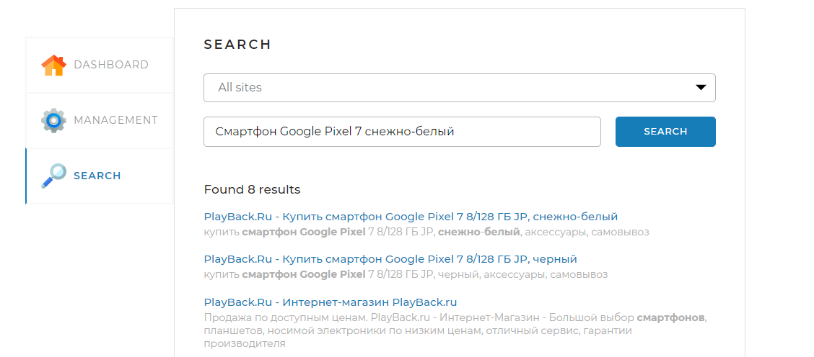

<h1 align="center">Search Engine Project</h1>
<h2 align="center">



</h2>

## Description

The search engine is a Spring application (a JAR file launched on any server or computer), operating with a local MySQL database, which has a simple web interface and API, through which they can be controlled and obtained by search results on request.

## Technology Stack

The following technology stack was used to build the Search Engine project:
- Java
- Spring Framework
- MySQL
- HTML
- CSS
- JavaScript

## Web interface

**Dashboard** - tab opens by default. It displays general statistics on all sites, as well as detailed statistics and status for each of the sites


**Management** - on tab there are a search engine control tools: starting and stopping a full indexation (reindexation), as well as the ability to add (update) a separate page on the link


**Search** - on the page there is a search field, dropping a list with websites for search, and when clicking on the “Find” button, the search results are displayed


## API specification
| Method | Description | Parameters | Success Result Format | Error Result Format |
| ------ | ----------- | ----------| --------------------- | -------------------- |
| GET /api/startIndexing | Triggers a complete indexation of all sites or complete reindexation, if they are already indexed | Method without parameters | {'result': true} | {'result': false, 'error': "Индексация уже запущена"} |
| GET /api/stopIndexing | Stops the current indexing process (reindexation) | Method without parameters | {'result': true} | {'result': false, 'error': "Индексация не запущена"} |
| POST /api/indexPage | The method adds to the index or updates a separate page, the address of which is transferred in the parameter | url — the address of the page that needs to be rendered | {'result': true} | {'result': false, 'error': "Данная страница находится за пределами сайтов, указанных в конфигурационном файле"} |
| GET /api/statistics | The method returns statistics and other official information about the state of search indices and the engine itself | Method without parameters | {'result': true, 'statistics': {"total": {"sites": 1,"pages": 5,"lemmas": 25,"indexing": true},"detailed": [{"url": "http://www.site.com","name": "site","status": "INDEXED","statusTime": 1600160357,"error": "Ошибка индексации: главнаястраница сайта недоступна","pages": 5,"lemmas": 25},...]} | {'result': false, 'error': "Ошибка получения статистики"} |
| GET /api/search | The method searches for the pages of the transferred search query | query — search query; site — The site on which to search (if not specified, search for all indexed sites); offset — shift from 0 for paginal output (default 0); limit — maximum result limit (default 20) | {'result': true,'count': 15,'data': [{"site": "http://www.site.com","siteName": "site","uri": "/path/6784","title":"page title","snippet": "Text fragment","relevance": 0.9},...]} | {'result': false, 'error': "Задан пустой поисковый запрос"} |

## Local Launch Instructions

To run the Search Engine project locally follow these steps:

1. Install Java JDK (17+ version)

2. Clone the repository to your local machine

3. Build the project using Maven

4. Package jar file, add configuration application.yaml to same folder

5. Install MYSQL Server (8+ version)

6. Create new schema with name searchengine (recomended use characterset utf8mb4 and utf8mb4_bin)

7. Start the Spring Boot server:

```
java -jar target/SearchEngine-1.0-SNAPSHOT.jar
```

8. Open a web browser and navigate to http://localhost:8080/ to access the search engine

Congratulations! You have successfully launched the Search Engine project locally.
